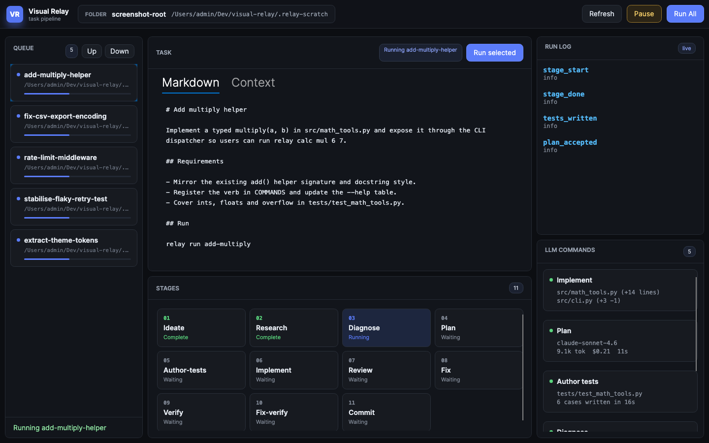

# Visual Relay

Visual Relay is an Avalonia desktop control room for Relay-style LLM task processing. It brings a staged task pipeline into a modern dark GUI for choosing a repository root, inspecting the task queue, reordering work, pausing at safe boundaries, and drilling into stages, logs, and LLM command traces.



## Install

```bash
brew install nicholas-westby/tap/visual-relay
```

This installs a self-contained Visual Relay — **no .NET SDK or runtime required**. The
only prerequisites are `uv` and `nono` (both pulled automatically by Homebrew):
`uv` provisions LiteLLM for the model backend on first launch; `nono` provides
OS-level sandboxing (Seatbelt on macOS, Landlock on Linux) for Swival subagents.

> **Important**: install via `brew` or `curl`, never download a `.tar.gz` through a
> browser. A browser download re-applies the `com.apple.quarantine` attribute, which
> triggers Gatekeeper. Installing via a Homebrew **formula** (not a cask) uses
> `curl` + `tar` internally — neither sets the quarantine flag — so `visual-relay
> launch` runs with **no Gatekeeper prompt and no notarization**. This is a terminal
> app for developers; there is no `.app` bundle to double-click.

After installing, run `visual-relay init` in your own repository (it auto-detects
your test command and writes `.relay/config.json`), then `visual-relay launch`.

## Run (source checkout)

If you are working from a source clone instead, use the launcher from the repo root:

```bash
./visual-relay launch
```

The launcher requires `nono` for sandboxed Swival execution (install via `brew install nono`
or from https://github.com/jedisct1/nono). If Nix is installed, `nono` (and all other
prerequisites) are provided automatically by the devshell — no global install required.
To run without the sandbox, set
`bypassSandbox:true` in `.relay/config.json`.

The app opens with a native folder picker button. Point it at a repo containing
`llm-tasks/` directories.

Common commands:

```bash
./visual-relay build
./visual-relay test
./visual-relay check
./visual-relay install-hooks
```

The launcher uses existing tools when available. If any required tool (`dotnet`, `nono`,
`uv`) is missing and `nix` is installed, it automatically re-enters the command through
`nix develop` — everything is provisioned from the Nix store with zero global installs
and no separate shell step.

**No Nix?** On an interactive terminal the launcher offers a single `[y/N]` prompt to
install [Determinate Nix](https://determinate.systems/nix) (the only global change;
everything else stays in the Nix store and per-user data dirs). An explicit `y` runs the
official installer and re-enters through `nix develop` — one keystroke to a fully
provisioned sandbox. A `n`, Enter, or a non-interactive context (CI, piped invocation)
prints a manual one-liner alongside the existing tool-missing messages and exits; nothing
global is ever installed without explicit per-invocation consent. There is no `--yes`
flag, no config key to pre-approve, and no persisted "already asked" state.

See [AGENTS.md](AGENTS.md) for contributor dev tooling (the `sample` tooling,
`run-task`, `screenshot`) — those are source-checkout-only and not shipped in the
Homebrew formula.

## Model Backend

Every Visual Relay profile targets a local OpenAI-compatible proxy (LiteLLM) at `http://127.0.0.1:4000`. Visual Relay owns this proxy's lifecycle, so `./visual-relay launch` auto-starts it before opening the app: the launch hook calls `tools/backend/backend.sh start` best-effort. When the backend is already healthy this is a fast no-op, and if it cannot start the app still launches and the in-app pre-flight probe surfaces the down backend.

On first start the script provisions LiteLLM itself — there is no manual install step. It uses [`uv`](https://docs.astral.sh/uv/) to create a project-local virtualenv at `tools/backend/.venv` pinned to Python 3.13 (LiteLLM's `uvloop` crashes on 3.14+) and installs `litellm[proxy]` into it; `uv` fetches the pinned Python automatically. The venv is git-ignored and reused on later starts, so only the first launch pays the install cost. The single prerequisite is `uv` on `PATH` (`curl -LsSf https://astral.sh/uv/install.sh | sh`); if a `litellm` is already on `PATH` and `uv` is absent, the script falls back to that.

Manage the proxy directly with:

```bash
tools/backend/backend.sh start    # idempotent; brings the proxy up on 127.0.0.1:4000 and waits for /health/readiness
tools/backend/backend.sh status   # reports up/down
tools/backend/backend.sh stop     # SIGTERM then SIGKILL, and removes the PID file
```

`start` is re-runnable any time: a healthy instance exits 0 with no duplicate process, a stale PID file is cleaned up automatically, and after launching it polls `/health/readiness` (up to ~30s) before returning. `stop` always removes the PID file, even after an abrupt kill, so the next `start` is never blocked by a stale pidfile. The PID and log files live under the git-ignored `.relay-scratch/` (`litellm.pid`, `litellm.log`).

### Provider keys

The proxy config `tools/backend/litellm-config.yaml` defines the model aliases the profiles reference (`cheap`, `balanced`, `frontier`, `vision`, `claude`, `claude-opus-1m`, `claude-sonnet`, `gpt-5`, `hf-qwen3-coder-next`, `kimi-k2`, `fallback`). No secrets are committed: every key is read from the environment via `os.environ/<KEY>`.

The **`fallback`** tier is the always-available floor: it resolves to `hf-qwen3-coder-next` (Hugging Face Novita Qwen3-Coder-480B, ~$0.38/$1.55 per 1M tokens in/out) and requires only `HF_TOKEN`. Every other tier can fall through to it when its provider keys are absent. Override the default model via `tierProfiles.fallback` in `.relay/config.json`.

**Primary location** (always writable, even for brew-installed copies):

```bash
mkdir -p ~/.config/visual-relay
# then create ~/.config/visual-relay/.env with KEY=VALUE lines
# (see .env.example for the full key set)
```

**Dev-only fallback** (source checkout):

```bash
cp .env.example .env   # repo-root .env, git-ignored
```

**Precedence**: an exported environment variable overrides both files; the user-level file overrides the repo file. The in-app key panel reads and writes the user-level path.

`backend.sh start` loads keys from both locations automatically. Before launching LiteLLM it **generates a key-aware config** at `.relay-scratch/litellm-config.generated.yaml`: each tier alias points directly at the best model whose provider key is present, so missing keys never incur an auth-error retry on the dead primary. The static `litellm-config.yaml` remains the single source of truth for provider routes and settings — only the alias and fallback assignments are rewritten. When the generator is unavailable (no `dotnet`), the script falls back to the static template. A one-line resolution summary is logged to stderr (e.g. `backend: config generated — cheap→deepseek-v4-flash, balanced→deepseek-v4-pro, frontier→kimi-k2, …; keys: HF_TOKEN, DEEPSEEK_API_KEY, MOONSHOT_API_KEY`), so "why did frontier run on HF?" is always answerable.

## Sandbox

Every Swival subagent runs under **nono** OS-level sandboxing by default (Seatbelt on macOS,
Landlock on Linux). The sandbox confines writes and deletes to the target workspace while
leaving reads, network, and all tools — including Playwright/Chromium — unrestricted. This is
**accident containment**, not defense against a malicious agent: a stray `rm -rf` or `mv`
outside the workspace is blocked by the OS.

The sandbox is controlled by the `bypassSandbox` key in `.relay/config.json`:

```json
{
  "testCmd": "dotnet test",
  "bypassSandbox": true
}
```

- **`false`** (default): Swival runs under nono with the `vr-guard` profile.
- **`true`**: Sandbox is disabled; Swival runs with full filesystem access.

The `vr-guard` profile ships with Visual Relay and is installed automatically to
`${XDG_CONFIG_HOME:-$HOME/.config}/nono/profiles/`. A missing nono binary is a hard error.

## What It Does

- Discovers `llm-tasks` while skipping `DONE-*`, `IGNORE-*`, `_ideation`, and `completed`; tasks marked `NEEDS-REVIEW` stay visible in the GUI with their review reason.
- Loads `.relay/config.json` and keeps Relay defaults for stages, tier profiles, test commands, and verify limits.
- Runs one task at a time through the Relay stage model with `.relay/ACTIVE`, ledger, manifest, seal, event, report, and trace artifacts.
- Shows native root selection, queue/archive controls, task markdown/context, stage status, structured run logs, and parsed LLM tool calls in a dense command-center layout.
- Streams Swival trace events into the GUI as assistant text, tool calls, tool results, and thinking records.
- Estimates time and rounded dollar cost per task and per stage from Swival reports, using Relay's current pricing model.
- Lets stage cards act as log filters: click a stage for that step's events/traces, click it again to return to the full task log.
- Marks committed tasks `DONE-` and archives batch tasks under `llm-tasks/completed/batch-N`.
- Uses Verify-supplied Conventional Commit subjects when available and allows the final staged set to be a subset of the manifest, matching current Relay behavior.
- Owns Swival execution directly, including temporary profile generation for the local LiteLLM proxy.
- Supports mocked execution in tests and real Swival/test command execution in the app and `run-task` smoke command.

## Development Rails

- `Directory.Build.props` enables nullable, latest analyzers, code style checks, and warnings as errors.
- `.githooks/commit-msg` enforces Conventional Commits after `./visual-relay install-hooks`.
- `tools/guards/check-file-size.sh` keeps C# and Avalonia XAML source files under 300 lines by default.
- `tools/VisualRelay.Screenshots` renders the README screenshots through Avalonia Headless at desktop and compact widths.
- `tools/VisualRelay.SampleTasks` (dev-only, not shipped in brew) regenerates a sample tasks repo for repeatable demos — see [AGENTS.md](AGENTS.md).

## Tests

```bash
./visual-relay check
```

The current automated coverage includes config loading, task discovery, archive listing, cost estimation, review-marker surfacing, nested task context, queue reordering, pause-at-boundary, stage log filtering, trace parsing, Swival profile/trace handling, crash flagging, and mocked staged driver artifacts.

Real smoke last run (source-checkout dev tooling, see [AGENTS.md](AGENTS.md)): `./visual-relay run-task` completed stages 1-11, streamed trace events, ran the Python tests red/green, committed `81013f0`, and archived the nested task folder under `llm-tasks/completed/batch-1`.
