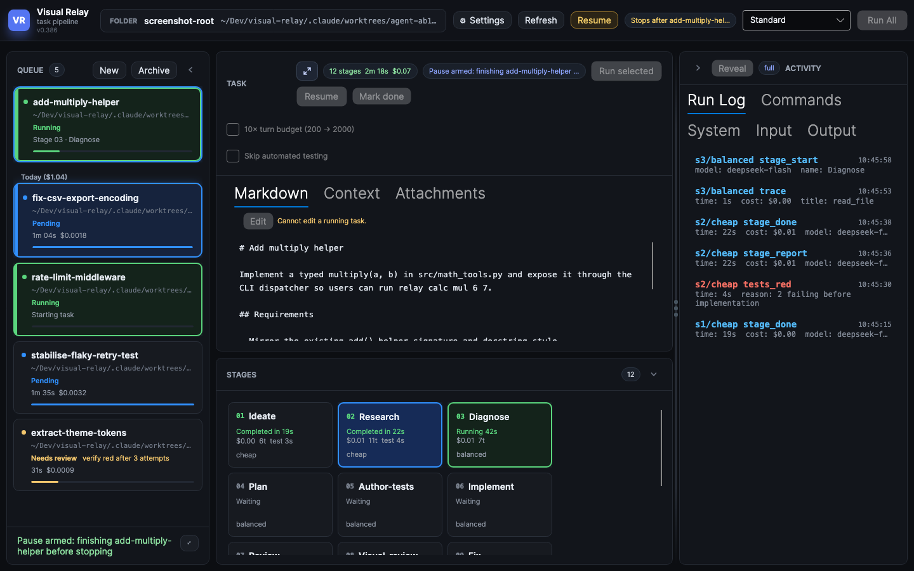

# Visual Relay

Visual Relay is a cross-platform desktop app that helps you build software by processing tasks with
LLMs using a relay-like pipeline, with each stage passing its output to the following stage.
You create markdown files as specs, and Visual Relay implements them via the pipeline.

- Mistakes are avoided by enforcing a strict set of steps the LLM can't bypass (e.g., red/green TDD).
- Costs are optimized by choosing an appropriate LLM model tier per stage (and by enforcing a budget).
- It also gives you easy ways to observe each step via the activity panel.
- All LLM interactions are sandboxed ([nono](https://nono.sh/) on macOS and [mxc](https://github.com/microsoft/mxc) on Windows) to avoid destructive file system changes.



# Install (macOS)

<!-- BEGIN install section (self-contained; sibling tasks may shorten the README) -->

The recommended way to run Visual Relay is to **clone the repo and launch it with the
`./visual-relay` wrapper** (one command bootstraps everything else):

```bash
cd ~/repositories # or wherever you keep your repos
git clone --depth 1 https://github.com/Nicholas-Westby/visual-relay.git
cd visual-relay
./visual-relay launch
```

`--depth 1` does a shallow clone (latest commit only) for a faster, smaller
download; omit it to fetch the full history.

`./visual-relay` is a tiny launcher that provisions its own toolchain via
[Nix](https://nixos.org) (this avoids global installs).

You can then run `./visual-relay` in that folder the next time you want to launch it.

# Install (Windows)

Clone the repo and run (nix doesn't run on Windows, so dependencies are installed globally):

```powershell
cd ~/repositories # or wherever you keep your repos
git clone --depth 1 https://github.com/Nicholas-Westby/visual-relay.git
cd visual-relay
./visual-relay launch
```

`--depth 1` does a shallow clone (latest commit only) for a faster, smaller
download; omit it to fetch the full history.

You can then run `visual-relay` in that folder the next time you want to launch it.

Note: the Windows sandbox (MXC) is not yet as robust as macOS's `nono` due to current MXC
limitations; see [TROUBLESHOOTING.md](TROUBLESHOOTING.md).

<!-- END install section -->

# What Visual Relay Does

- Runs `llm-tasks/` one task at a time through the staged relay pipeline, writing ledger,
  manifest, seal, event, report, and trace artifacts. These help keep the pipeline honest.
- Presents a command center GUI: select your project folder, queue/archive controls,
  per-stage status, structured run logs, and stage cards that double as log filters.
- Streams [Swival](https://swival.dev/) trace events live into the GUI as assistant text,
  tool calls, tool results, and thinking records.
- Estimates time and monetary cost per task and per stage from Swival reports.

# Task Templates

The New-task form offers a template dropdown. Templates are markdown files with an
optional `---` frontmatter block (`name:` labels the dropdown, `title:` prefills the
task title); the rest of the file prefills the body. Don't start a template body with
a `# Heading` — task creation prepends one from the title.

Three layers, most local wins (matched by filename): built-in templates ship with the
app; user templates live in `~/.config/visual-relay/templates/` (respects
`XDG_CONFIG_HOME`; sandboxed task runs may write here too); repo templates live in
`llm-tasks/templates/` and can be edited even during an active run, like task specs.
Drop a new `.md` file in either folder — the dropdown re-reads them each time the
form opens.

A template can also ship companion files: put them in a sibling directory named
after the template (`templates/my-template/` next to `templates/my-template.md`).
Creating a task from the template copies every file in that directory into the new
task's folder, beside the task markdown (dotfiles are skipped). The winning layer's
directory is taken whole — attachments never merge across layers. The built-in
speed-up-tests template uses this to ship `commit-message-evidence.md`, the
fill-in-the-blanks instructions for measured timing evidence in commit messages.

# Tests

To run the main test suite:

```bash
./visual-relay test
```

Or for the more involved checks (runs the file-size guard, format verification, build,
test suite, and the README screenshot render):

```bash
./visual-relay check
```

# Tech Stack

The code is mostly C# and the UI is built with [Avalonia](https://avaloniaui.net).

# Commands

- `./visual-relay` - launches the app.
- `./visual-relay launch` also launches the app.
- `./visual-relay build` - builds the app (the launcher also does this).
- `./visual-relay install-hooks` - installs pre-commit hooks.
- `./visual-relay test` - runs the test suite.
- `./visual-relay check` - runs the file-size guard, format verification, build, the test suite, and the README screenshot render.

## Learn more

- [docs/OPERATIONS.md](docs/OPERATIONS.md) - model backend (LiteLLM proxy lifecycle) and the nono sandbox.
- [TROUBLESHOOTING.md](TROUBLESHOOTING.md) - diagnosing the dev loop and test hangs.
- [AGENTS.md](AGENTS.md) - contributing, the control API, and dev-only tooling.
- [docs/DESIGN.md](docs/DESIGN.md) for the full architecture and the 12-stage mapping.
